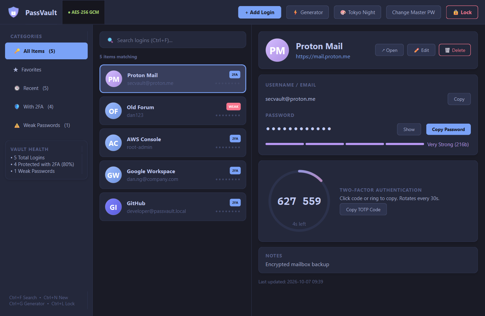
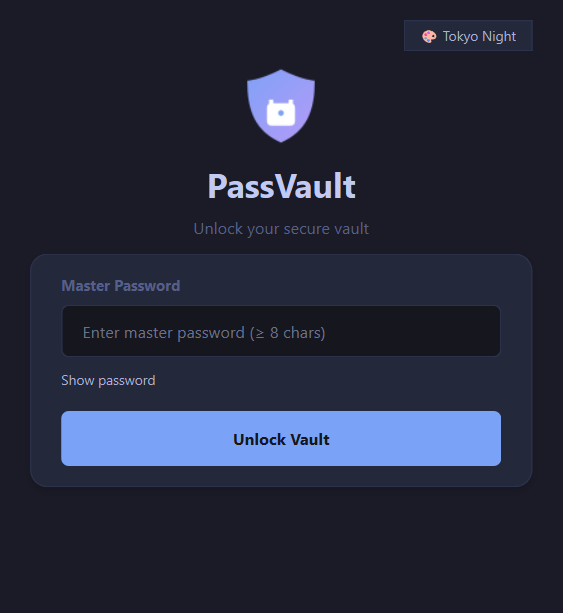
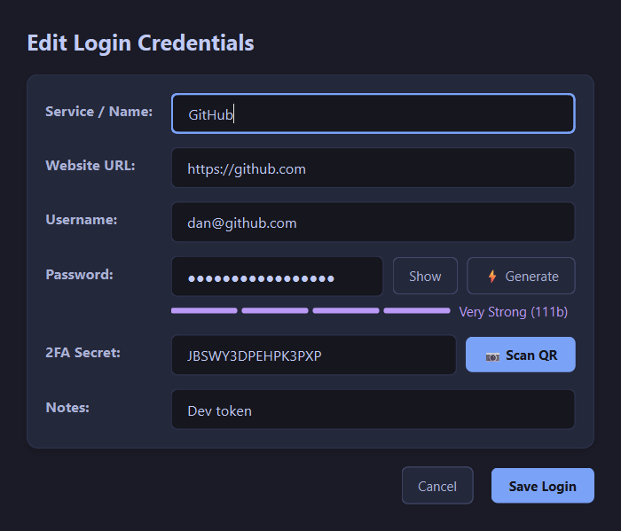
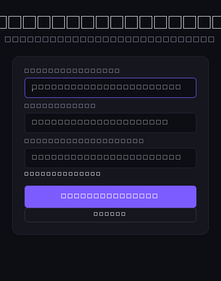

# 🔐 PassVault

> **Modern, Local-First Password & 2FA Manager built with Python & PyQt6.**

PassVault is an elegant, offline-only desktop credential manager featuring **Argon2id** key derivation, **AES-256-GCM** authenticated encryption, built-in **TOTP 2FA generator**, an on-screen **QR code scanner**, password strength auditing, and 8 sleek designer themes.



---

## ⚠️ Disclaimer & Philosophy

> [!IMPORTANT]
> **PassVault is a local-first learning and personal management project.** If you require multi-device cloud synchronization, team sharing, audited browser auto-fill, or mobile apps, we strongly recommend using an established audited manager like [Bitwarden](https://bitwarden.com/).

| Feature | PassVault | Bitwarden |
| :--- | :---: | :---: |
| **Independent Security Audit** | ❌ No | ✅ Yes (Third-party audited) |
| **Browser Extension & Auto-fill** | ❌ Manual Copy/Paste | ✅ Chrome, Firefox, Safari, Edge |
| **Cross-Device Cloud Sync** | ❌ Local SQLite only | ✅ End-to-End Encrypted Cloud |
| **Biometric Unlock (Touch ID/Hello)** | ❌ Master Password only | ✅ Yes |
| **Pricing** | Free & Open Source | Free / $10/year Premium |

---

## 🌟 Key Features

* 🔐 **Cryptographically Robust Security:**
  - **Argon2id KDF:** High-memory (64 MB, 3 iterations, 4 threads) derivation resists GPU/ASIC brute-force attacks.
  - **AES-256-GCM Authenticated Encryption:** Protects sensitive fields (passwords, TOTP secrets, notes) and detects any database tampering via GCM auth tags.
  - **Two-Tier Key Hierarchy:** The Master Key wraps a dedicated Vault Data Key. Changing the master password only re-wraps the master key without needing to re-encrypt all vault entries.
* 📷 **On-Screen QR Code Scanner for 2FA:**
  - Capture authenticator QR codes directly from your screen with a transparent selection box. Automatically parses `otpauth://totp/...` URIs using OpenCV and Pillow.
* 🔢 **Integrated TOTP 2FA Authenticator:**
  - RFC 6238 compliant 6-digit one-time password generator with a live 30-second countdown progress bar.
* 🎲 **CSPRNG Password Generator:**
  - Generate cryptographically secure passwords with customizable length, symbols, digits, and uppercase/lowercase letters.
* 📊 **Real-Time Password Strength Meter & Audit:**
  - Evaluates password complexity, entropy, repetition patterns, and warns of weak or compromised passwords.
* 📋 **Clipboard Security (Auto-Wipe):**
  - Copied credentials are automatically purged from the Windows/system clipboard after **30 seconds** to prevent snooping.
* 🎨 **8 Designer UI Themes:**
  - Switch effortlessly between **Tokyo Night**, **Catppuccin Mocha**, **Dracula**, **Nord**, **Gruvbox Dark**, **Solarized Dark**, **Solarized Light**, and **Matrix**.
* 🧳 **Zero-Install Portable Mode:**
  - Run completely self-contained from a USB drive via `portable.flag`. Vault data is kept inside `portable/data/` without modifying system files.
* 📦 **Single-Binary PyInstaller Packaging:**
  - Build into a standalone `.exe` with icon and bundled dependencies.

---

## 📸 Screenshots

| Unlock Vault | Add / Edit Item & TOTP | Change Master Password |
| :---: | :---: | :---: |
|  |  |  |

---

## 📦 Architecture & Directory Structure

```text
passvault/
├── main.py                     # Application entry point, theme lifecycle & lock manager
├── build.py                    # PyInstaller packaging script
├── make_portable.py            # Generates standalone portable release package
├── install.bat                 # 1-click Windows installer (creates desktop shortcuts)
├── requirements.txt            # Python dependencies
├── core/
│   ├── crypto.py               # Argon2id KDF & AES-256-GCM encryption/decryption
│   ├── vault.py                # Vault session, key wrapping & state management
│   ├── database.py             # SQLite encrypted storage engine
│   ├── password_gen.py         # CSPRNG secure password generator & entropy calculation
│   ├── totp.py                 # RFC 6238 TOTP generator (pyotp wrapper)
│   └── qr_scanner.py           # Screen capture & QR decoding engine (MSS + OpenCV)
└── ui/
    ├── main_window.py          # Primary vault browser, search, category filter & table
    ├── item_dialog.py          # Credential creation & editing modal with QR scanner hook
    ├── unlock_dialog.py        # Master password authentication dialog
    ├── change_password_dialog.py # Master password rotation & key re-wrapping modal
    ├── qr_overlay.py           # Transparent screen-selection overlay for QR capture
    ├── theme.py                # 8 curated modern dark and light color schemes
    └── widgets.py              # Custom UI components (strength meters, countdown bars)
```

---

## 🚀 Quick Start Guide

### 1. Prerequisites
* Python **3.10+** installed on your system.

### 2. Installation
Clone the repository and install the dependencies:
```bash
git clone https://github.com/your-username/passvault.git
cd passvault
pip install -r requirements.txt
```

### 3. Run from Source
```bash
python main.py
```
* **First Run:** You will be prompted to create your vault and choose a strong **Master Password** (minimum 8 characters).
* **Subsequent Runs:** Enter your Master Password to unlock and decrypt the vault.

---

## 🔨 Packaging & Distribution

### Build Standalone Executable (.exe)
To package PassVault into a single self-contained Windows executable:
```bash
python build.py
```
* Output file: `dist/PassVault.exe`

### Build Portable USB Package
To bundle a self-contained portable directory that can be placed on an external flash drive:
```bash
python make_portable.py
```
* Output folder: `portable/` (contains `PassVault.exe`, `portable.flag`, `Run_PassVault.bat`, and `data/`)

---

## 🛡️ Security Architecture

### Cryptographic Primitives
1. **Key Derivation (Argon2id):**
   * Memory cost: `65536 KiB` (64 MB)
   * Time cost: `3 iterations`
   * Parallelism: `4 lanes`
   * Salt: `16-byte CSPRNG random salt`
2. **Authenticated Encryption (AES-256-GCM):**
   * Nonce: `12-byte (96-bit) CSPRNG random IV` per entry
   * Tag: `16-byte (128-bit) GCM authentication tag`
   * Prevents chosen-ciphertext attacks and detects database file corruption or tampering.
3. **Key Hierarchy:**
   * **Derived Key:** Computed from `Master Password + Salt` via Argon2id.
   * **Master Key:** A cryptographically random 256-bit key used to encrypt entries. Wrapped by the Derived Key using AES-256-GCM.
   * Rotating the master password simply re-wraps the Master Key with a new Derived Key.

### Storage Layout
* **Standard Mode:** Vault database is stored at `~/.passvault/vault.db`
* **Portable Mode:** Vault database is stored at `portable/data/vault.db`
* All sensitive credentials in `vault.db` are stored strictly as encrypted binary blobs. Without the master password, the database is computationally unreadable.

---

## 📄 Dependencies
* [PyQt6](https://www.riverbankcomputing.com/software/pyqt/) — Modern GUI toolkit
* [cryptography](https://cryptography.io/) — Industry-standard AES-GCM and cryptographic primitives
* [argon2-cffi](https://argon2-cffi.readthedocs.io/) — Argon2id password hashing and key derivation
* [pyotp](https://pyauth.github.io/pyotp/) — RFC 6238 TOTP two-factor authentication
* [opencv-python](https://opencv.org/) & [mss](https://github.com/BoboTiG/python-mss) — Screen capture & QR code scanning
* [Pillow](https://python-pillow.org/) — Image processing

---

## 📜 License
This project is licensed under the **MIT License**.
